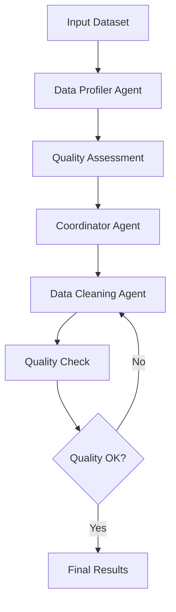

# Multi-Agent Data Processor Architecture

## Overview
This system uses a multi-agent architecture to process and clean datasets intelligently.

## Components

### Agents
- **Coordinator Agent**: Orchestrates the entire pipeline
- **Data Profiler Agent**: Analyzes dataset characteristics  
- **Data Cleaning Agent**: Performs intelligent data cleaning
- **Quality Assurance Agent**: Evaluates data quality

### Communication
- Message-based communication between agents
- Centralized coordination and decision making
- Quality gates and iterative processing

## Data Flow
1. Data Profiling → Quality Assessment → Strategy Creation
2. Data Cleaning → Quality Check → Decision (Continue/Complete)
3. Final Assessment → Documentation → Results

## Agent Interactions

## Quality Dimensions

The system evaluates data across five key dimensions:

1. **Completeness**: Missing data percentage
2. **Consistency**: Format standardization
3. **Validity**: Data type correctness
4. **Uniqueness**: Duplicate detection
5. **Integrity**: Cross-column relationships

## Technology Stack

- **Language**: Python 3.8+
- **AI Models**: OpenAI GPT-4 and GPT-3.5-turbo
- **Data Processing**: Pandas, NumPy
- **Communication**: Custom message broker
- **Testing**: Pytest
- **Configuration**: Python-dotenv
